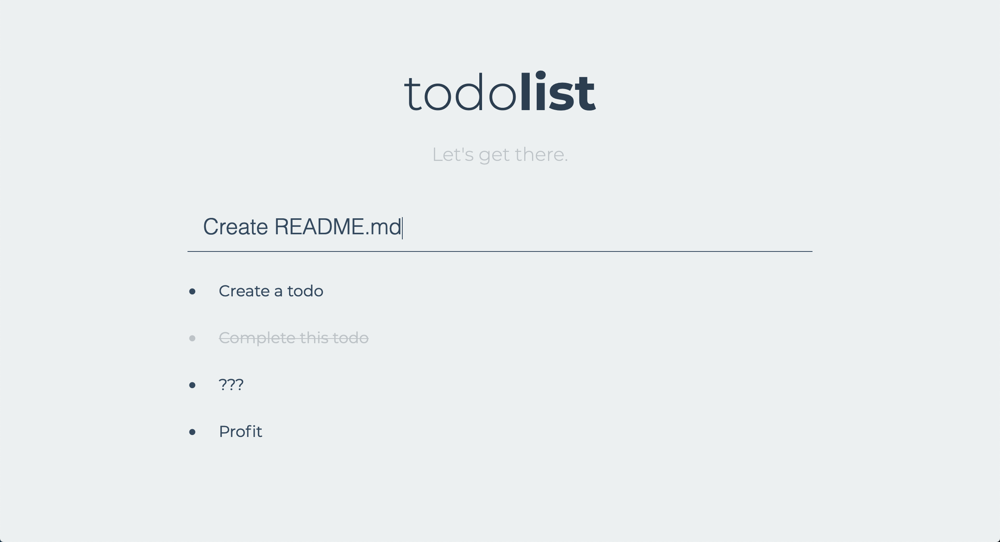

# Todos App
## Let's get things done.

A sample Mongo, Express, jQuery, and Node App which manages Todos.

### User Interface

### Useful Scripts
Use `bash ./scripts/run_db.sh` to start MongoDB docker. (Be sure you have a Mongo docker image available: `docker pull mongo`)

Use `yarn start` to start web server. (Use `yarn` to install dependencies!) If you are doing development, use `yarn dev` to use nodemon.

Use `bash ./scripts/seed_db.sh` to populate a couple sample todo items.

Use `yarn test` to run some basic API tests.

Use `node ./scripts/delete_all.js` to use webserver endpoints to delete all todos.

### Endpoints
#### GET /api/todos
Index route.
`bash ./scripts/index.sh`

#### POST /api/todos
Create route.
`bash ./scripts/seed_db.sh`

#### GET /api/todos/:_id
View route.

#### PUT /api/todos/:_id
Update route. Supports partial updates.
`bash ./scripts/sample_update.sh`

#### DELETE /api/todos/:_id
Delete route.
`bash ./scripts/sample_delete.sh`
